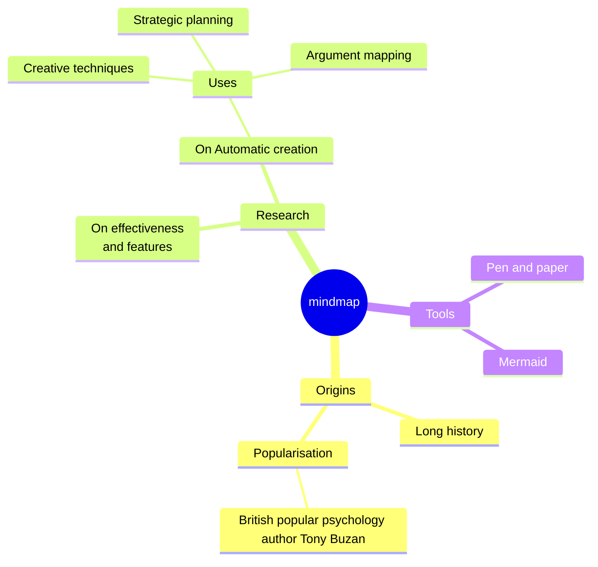
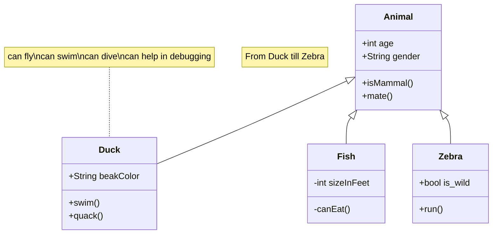
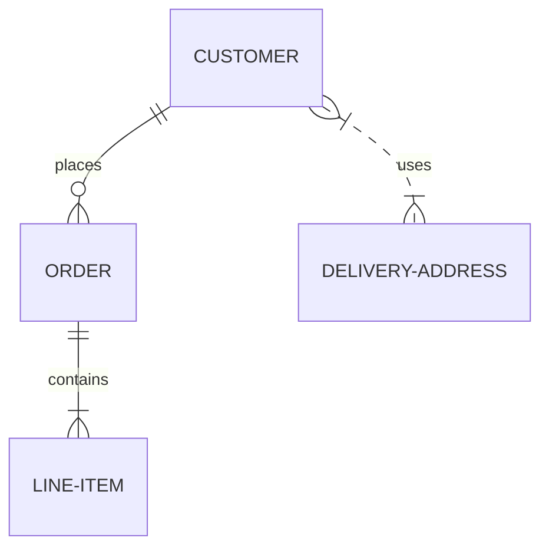

# Arquitectura-Modulo-Analitics-SCADA

El desarrollo propone la construcción de un módulo de análisis avanzado de un sistema SCADA (Supervisory Control and Data Acquisition). Este módulo permite recopilar, procesar y analizar datos provenientes de los sistemas dentro de un entorno, con el objetivo de proporcionar información valiosa y conocimientos útiles para la predicción de la vida útil de los sistemas de mantenimiento, además de apoyar en toma de decisiones y la optimización del rendimiento en los procesos de supervisión y control.

Características Módulo de Análisis:

- Recopilación de Datos: El módulo tiene la capacidad de recopilar datos desde la base de datos centralizada del sistema, la cual corre bajo protocolos SQL server.
Procesamiento y Transformación de Datos: El módulo cuenta con algoritmos y técnicas para procesar y transformar los datos recopilados en información significativa, esto implica aplicar técnicas de filtrado, normalización y corrección de datos, así como realizar cálculos y agregaciones para generar métricas relevantes.

- Análisis Estadístico: El módulo proporciona capacidades de análisis estadístico para identificar patrones, tendencias y anomalías en los datos. Incluye técnicas como análisis de regresión, análisis de series temporales, análisis de frecuencia y análisis de correlación, con el objetivo de comprender el comportamiento del sistema en diferentes condiciones y tomar medidas proactivas para prevenir problemas o mejorar la eficiencia.

- Modelado Predictivo: El módulo ofrece funcionalidades de modelado predictivo que permiten desarrollar modelos matemáticos y algoritmos de aprendizaje automático (machine learning) para predecir el comportamiento futuro del sistema. Estos modelos pueden ser utilizados para anticipar fallas, detectar condiciones anómalas o realizar pronósticos de producción, lo que ayuda a evitar interrupciones costosas y optimizar los recursos.

- Visualización y Reportes: El módulo proporciona una interfaz gráfica intuitiva que permite visualizar los resultados del análisis. Los datos se presentan a través de gráficos interactivos, tablas y paneles de control personalizables, además, se pueden generar reportes automatizados para comunicar los resultados del análisis y compartirlos con el personal involucrado en la toma de decisiones.

## Ejemplo Mapa mental

### Ejemplo Diagrama Relacional

### Ejemplo Entidad Relación

